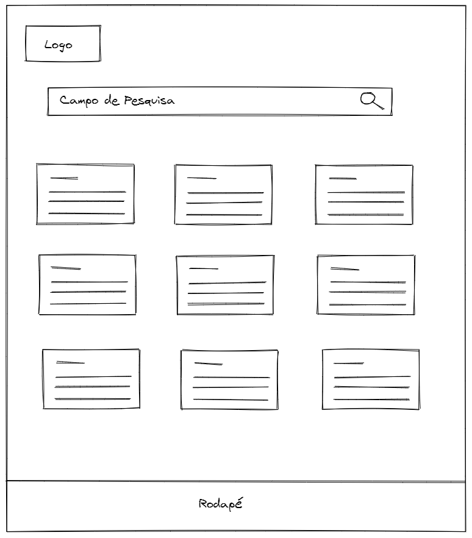
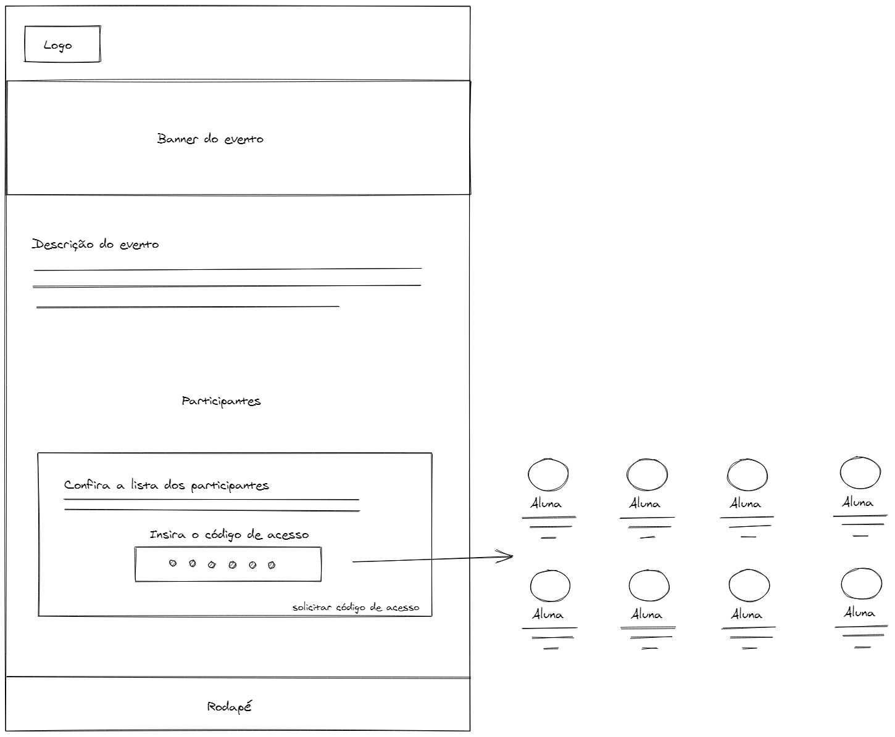
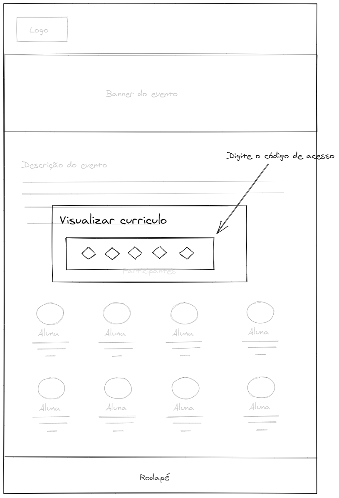
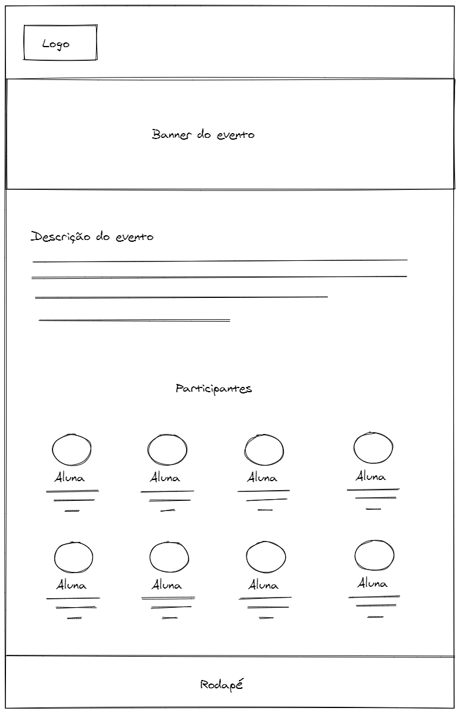
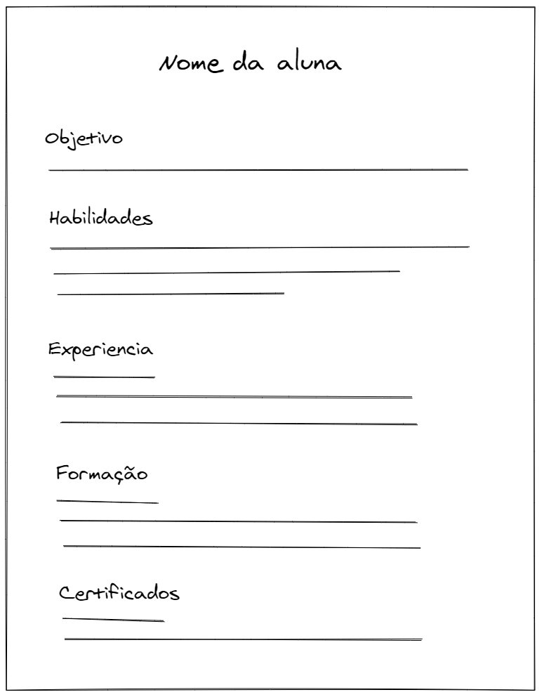

# 📃 Artefatos do projeto: CV Speed Hiring

****

## 🎨 Wireframes

1. [Tela inicial](#tela-inicial)
2. [Detalhe do evento](#detalhe-do-evento)
3. [Código de acesso a participantes](#codigo-de-acesso-a-participantes)
4. [Detalhe do evento (identificado)](#detalhe-do-evento-identificado)
5. [Currículo da aluna](#curriculo-da-aluna)

****

	

## 🏠 Tela inicial

[Arquivo editável](https://excalidraw.com/#json=5710652454731776,Wozhq5Kj3YInQF03BtM-bg)

****

	

## 🔐 Detalhe do evento 

[Arquivo editável](https://excalidraw.com/#json=6495136552845312,ZHQ9xCYttRPaYhMzxbWYmA)

****

	

## 🔑 Código de acesso a participantes

[Arquivo editável](https://excalidraw.com/#json=6220800575143936,i2JhIOx6kJ9T8QK9qvJ_Ww)

****

	

## 🔓 Detalhe do evento (identificado)

[Arquivo editável](https://excalidraw.com/#json=5664339084181504,oiMsrzxVG8Iz7s6wJztF6A)

****

	

## 📝 Currículo da aluna

[Arquivo editável](https://excalidraw.com/#json=6236878156070912,JiSxtJV8juYsnsUF5TiWGg)
